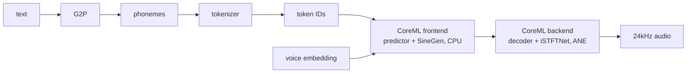
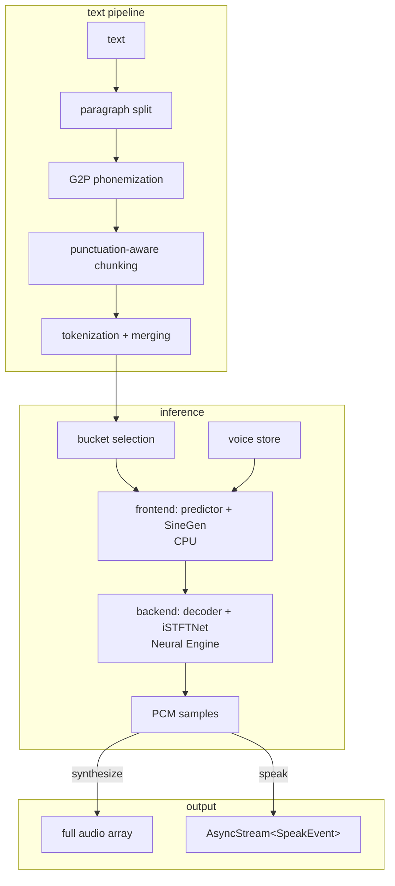

# kokoro-ane

text-to-speech in Swift. give it text, get 24kHz audio back.

Kokoro-82M on the Apple Neural Engine via CoreML. 6-16x real-time on M-series depending on input length. handles any length text -- automatic chunking, streaming, voice selection, speed control.

## install

```swift
// Package.swift
dependencies: [
    .package(url: "https://github.com/Jud/kokoro-ane.git", from: "0.3.0"),
]
```

models (~640MB) download automatically on first use. or grab them manually:

```bash
./scripts/download-models.sh
```

## usage

basic synthesis -- give it text, get samples back:

```swift
import KokoroANE

let engine = try KokoroEngine(modelDirectory: modelPath)
let result = try engine.synthesize(text: "hello world", voice: "af_heart")
// result.samples → 24kHz mono PCM float array
// result.duration → audio length in seconds
// result.realTimeFactor → how much faster than real-time
```

### streaming

for long text, `speak()` streams audio as it's synthesized. each chunk yields a `SpeakEvent` -- either playback-ready audio or an error if a chunk failed:

```swift
let audioEngine = AVAudioEngine()
let player = AVAudioPlayerNode()
audioEngine.attach(player)
audioEngine.connect(player, to: audioEngine.mainMixerNode, format: KokoroEngine.audioFormat)
try audioEngine.start()
player.play()

for await event in try engine.speak("any length text...", voice: "af_heart") {
    switch event {
    case .audio(let buffer): player.scheduleBuffer(buffer)
    case .chunkFailed(let error): print("chunk failed: \(error)")
    }
}
```

no manual chunking. no PCM conversion. text goes in, playback-ready audio comes out.

### direct IPA input

skip the G2P pipeline and pass IPA phonemes directly:

```swift
let result = try engine.synthesize(ipa: "hˈɛloʊ wˈɜːld", voice: "af_heart")
```

useful for fine-grained pronunciation control or pre-processed text.

### speed control

```swift
let slow = try engine.synthesize(text: "take your time", voice: "af_heart", speed: 0.7)
let fast = try engine.synthesize(text: "let's go", voice: "af_heart", speed: 1.5)
```

## CLI

```bash
make install
```

```bash
kokoro say "hello from the terminal"
kokoro say -v am_adam -s 1.2 "speed it up"
kokoro say -o output.wav "save to file"
kokoro say --stream "start hearing audio before synthesis finishes"
kokoro say --ipa "hˈɛloʊ wˈɜːld"
echo "long article" | kokoro say --stream
kokoro say --list-voices
kokoro daemon start   # keep models loaded for fast repeat synthesis
kokoro daemon stop
```

`--stream` starts playback as soon as the first chunk is ready. reports time-to-first-audio and per-chunk stats.

`--ipa` accepts IPA phonemes directly, skipping G2P.

models download on first run. `--model-dir <path>` to override.

## how it works



text goes through an english G2P pipeline -- lexicon lookup, morphological stemming, number expansion. unknown words hit a fallback chain:

1. **CamelCase splitting** -- "AVAudioPlayer" → "AV" + "Audio" + "Player", each part resolved independently
2. **BART neural G2P** -- per-part, so "AVKubernetesPlayer" → AV(spelled) + Kubernetes(BART) + Player(lexicon)
3. **letter spelling** -- last resort for acronyms

phonemes get tokenized and fed to the CoreML models with a voice style embedding.

the engine picks the smallest model bucket that fits:

| bucket | max tokens | audio length |
|--------|-----------|-------------|
| small  | 124       | ~5s         |
| medium | 242       | ~10s        |

longer text gets chunked at sentence boundaries and merged where possible. `synthesize()` returns the full result. `speak()` streams chunks as `SpeakEvent` via `AsyncStream`.

## architecture



## model

- **architecture**: Kokoro-82M -- StyleTTS2 encoder + iSTFTNet vocoder, split frontend (CPU) + backend (ANE)
- **sample rate**: 24kHz mono
- **voices**: style embedding vectors, one JSON per voice preset
- **runtime**: CoreML -- frontend on CPU, backend on Apple Neural Engine
- **platform**: macOS 15+, iOS 18+

## license

Apache 2.0
